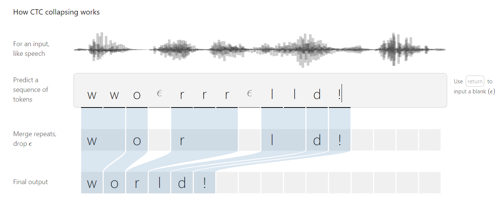
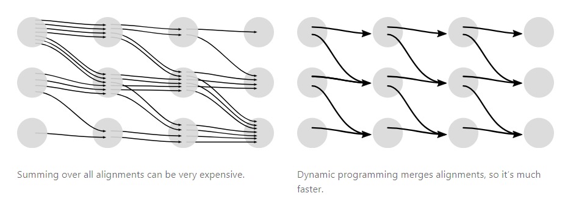
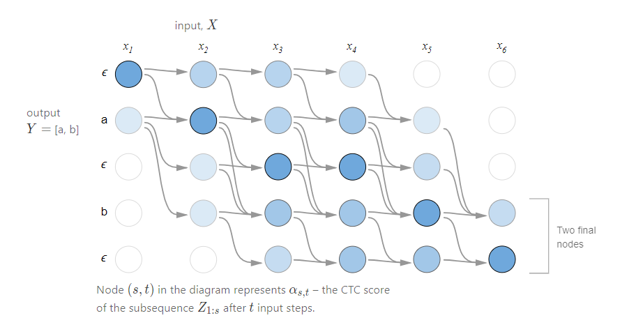
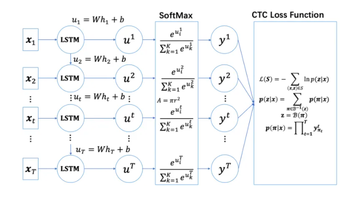
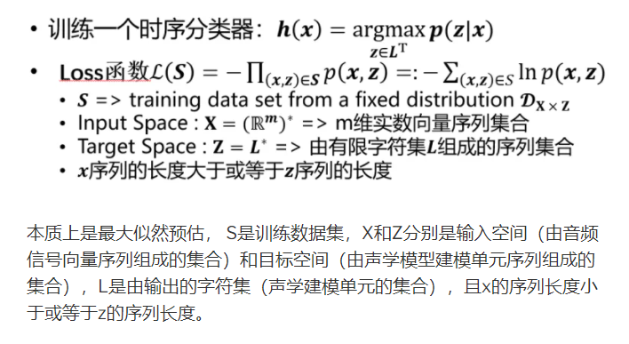

ASR 训练里有一个基础矛盾：音频是长帧序列，文本是短标签序列，但训练数据通常只有整句转写，没有每个字对应哪几帧的强制对齐。CTC（Connectionist Temporal Classification）解决的就是这个问题。

它的核心不是一个普通 loss，而是一套弱对齐建模方式：允许模型在不知道帧级标签的情况下，对所有可能对齐路径求和，再优化目标文本的总概率。

<!--more-->

## 要解决的问题

给定语音输入 $X=[x_1,x_2,...,x_T]$ 和文本输出 $Y=[y_1,y_2,...,y_U]$，ASR 需要学习 $X$ 到 $Y$ 的映射。困难在于：

- $T$ 和 $U$ 长度不同，比例不固定；
- 哪些帧对应哪个字符事先不知道；
- 静音、拖音、重复字符都会让对齐路径不唯一。

如果必须先做精确帧级标注，训练成本会非常高。CTC 的价值就是把这个强标注需求去掉。



## 主线判断

CTC 的主线不是一个 loss 公式，而是在没有帧级标注时管理对齐不确定性。

blank、重复折叠和路径求和让训练变得可行，但也引入了新的诊断问题：模型到底是声学分不清，还是 blank 过强、输入过短、解码约束太弱。CTC 工程调试要围绕这些对齐信号展开。

## 最小抽象

CTC 引入 blank 符号，把一个标签序列扩展成多条可折叠路径。折叠规则很简单：先合并连续重复，再删除 blank。

以 `hello` 为例，路径可以包含重复字符和 blank：

```text
h h e _ _ l l l _ l l o -> h e _ l _ l o -> hello
```

这样，同一个文本可以对应很多帧级路径。CTC loss 计算的是这些合法路径概率之和：

$$p(Y|X)=\sum_{A \in A_{X,Y}}\prod_{t=1}^{T}p_t(a_t|X)$$

直接枚举路径不可行，所以 CTC 用动态规划做前向后向求和。





## 工程闭环

CTC 的工程判断要分训练和解码两部分。

训练阶段关注 loss 是否稳定下降、blank 概率是否长期过高、短句和长句是否都能收敛。CTC 对输入长度和标签长度很敏感，过短输入或过长标签会直接导致不可对齐。

解码阶段通常从 greedy search 或 beam search 开始：

- greedy search 每帧取最大概率，速度快但容易局部错误；
- beam search 保留多个候选路径，可以接语言模型，但成本更高。





CTC 的主要缺陷是条件独立假设。每个时间步输出相对独立，语言层面的长程依赖较弱，因此常见做法是在 CTC 后接语言模型、与 AED 联合训练，或用 Transducer 类结构改进流式建模。

## 小样本推演

一个小样本可以包含三类句子：单字短句、重复音节句、长句。训练后分别看每类样本的 frame-level posterior。

如果短句几乎全是 blank，可能是 blank bias 或输入长度设置问题；如果重复音节被折叠丢失，要检查 blank 是否足以分隔重复标签；如果长句尾部删除严重，要看 encoder 下采样后长度是否仍满足 CTC 对齐约束。

## 直接结论

CTC 最适合作为“无帧级对齐训练”的基础工具。它让 ASR 可以从整句转写直接学习，但也把语言建模能力留给了解码器、外部语言模型或联合模型。

工程上不要只把 CTC 当 loss 名称看。真正要观察的是：输入和标签是否可对齐、blank 是否正常、beam search 是否带来稳定收益、错误主要来自声学混淆还是语言约束不足。

下一步阅读：[LAS 模型：把语音识别改写成听、对齐、拼写](/2021/08/24/ASR-LAS-model/)

### References

[1] [Sequence Modeling With CTC](https://distill.pub/2017/ctc/)
[2] [CTC Explained](https://xiaodu.io/ctc-explained/)
[3] [CTC 解读](https://zhuanlan.zhihu.com/p/42719047)
