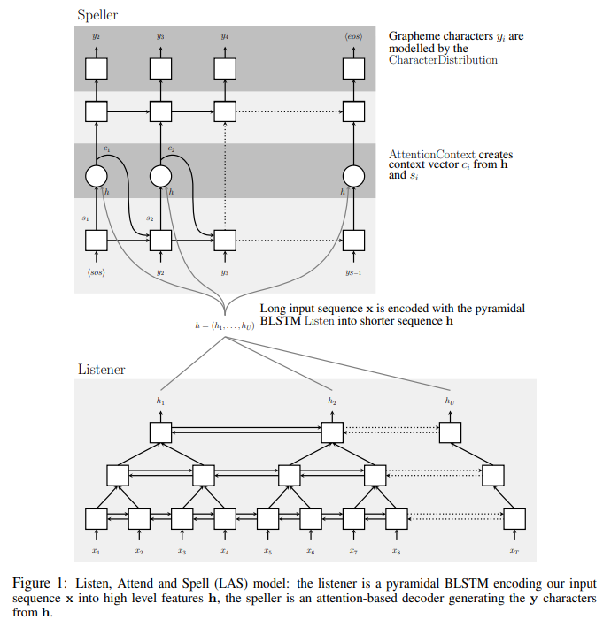

### 前言

&nbsp;&nbsp;&nbsp;&nbsp;论文《Listen Attend and Spell》LAS模型简介及代码复现
<!--more-->
&nbsp;&nbsp;&nbsp;&nbsp;论文地址: https://arxiv.org/abs/1508.01211v2

### 论文核心思想

&nbsp;&nbsp;&nbsp;&nbsp;语音识别模型，模型分为两个部分：listener和speller：
&nbsp;&nbsp;&nbsp;&nbsp;&nbsp;&nbsp;&nbsp;&nbsp;listener是三角形的pyramidal bidirecional lstm。
&nbsp;&nbsp;&nbsp;&nbsp;&nbsp;&nbsp;&nbsp;&nbsp;spller是基于attention的decoder,论文的label是以字符为单位的。

&nbsp;&nbsp;&nbsp;&nbsp;Encoder:
&nbsp;&nbsp;&nbsp;&nbsp;Decoder:

### 论文复现代码参考

&nbsp;&nbsp;&nbsp;&nbsp;pytorch版: https://github.com/AzizCode92/Listen-Attend-and-Spell-Pytorch

### LAS模型原理图

### References

[1]《https://zhuanlan.zhihu.com/p/80967163》
