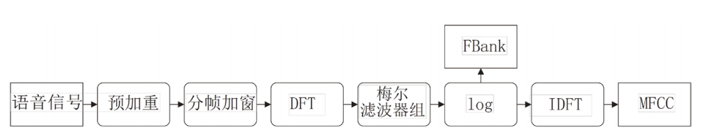
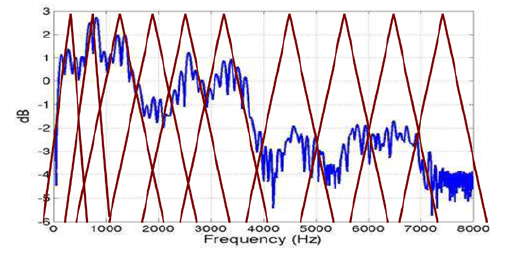

ASR 模型看到的通常不是原始波形，而是一组经过短时分析和频率压缩的声学特征。预加重、分帧、加窗、傅里叶变换、Mel 滤波这些步骤看起来像传统信号处理清单，但它们共同解决一个问题：**把连续、非平稳的语音波形变成模型可以稳定学习的局部谱表示**。

<!--more-->

## 要解决的问题

语音信号是非平稳的。整段音频的统计属性会随时间变化，但在几十毫秒的短窗口内又近似平稳。ASR 前端要利用这个短时平稳性，把波形切成局部片段，再提取频域能量分布。

典型流程如下：

这条链路的目标不是追求“最复杂的特征”，而是让模型输入满足三个条件：时间局部、频率可解释、尺度相对稳定。

## 主线判断

ASR 前端的主线不是选择哪种特征更传统，而是定义训练和推理共同遵守的输入契约。

预加重、分帧、加窗、Mel 滤波和 log 压缩都可以替换，但不能在训练、评测和线上推理之间悄悄变化。只要输入契约漂移，模型看到的就不是同一个任务，后续排查会被误导成模型结构或数据规模问题。

## 最小抽象

预处理可以压成四步。

预加重增强高频信息：

$$y[n]=x[n]-\alpha x[n-1], \alpha \in [0.9,1.0]$$

分帧加窗把非平稳信号切成短时平稳片段。常见设置是 16 kHz 采样率下 25 ms 帧长、10 ms 帧移，也就是 400 个采样点窗口和 160 个采样点步长。窗函数减少频谱泄漏，Hamming 窗比矩形窗更适合作为默认选择。

DFT/FFT 把每帧从时域转到频域，得到能量谱。Mel 滤波器再把线性频率压到更接近人耳感知的频率尺度：

$$mel(f)=2595\log_{10}(1+\frac{f}{700})$$

最后通常取 log，得到 log Mel filterbank 或 MFCC 类特征。

## 工程闭环

前端参数不能脱离模型和场景单独优化。至少要记录：

- 采样率、帧长、帧移；
- Mel 滤波器个数和频率范围；
- 是否使用预加重、CMVN 或能量特征；
- 是否和训练、推理、数据增强保持一致；
- 改动后 WER、实时率和边界音素错误是否变化。

很多 ASR 问题看起来是模型问题，实际来自前端不一致。例如训练用 16 kHz，推理输入却被错误重采样；训练和推理的 log base、Mel 范围或 CMVN 统计不同；切片边界没有保留足够上下文。这些问题不会靠更大模型自动消失。

## 小样本推演

一个最小排查样本可以只取三条音频：短静音开头、正常语速短句、含高频辅音的短句。先固定模型不变，只比较训练前端和推理前端输出的特征维度、帧数、均值方差和 Mel 频率范围。

如果同一条音频在两条链路里帧数不同，先不要调 decoder；如果 log base 或重采样不同，WER 下降也不能直接归因给模型。前端排查的目标，是先证明模型输入没有被系统误差污染。

## 直接结论

ASR 前端的价值在于把语音变成稳定、局部、可比较的声学表示。现代模型可以弱化部分手工特征，但不能忽略输入契约。只要训练和推理前端不一致，后面的模型再强也会被错误输入拖垮。

下一步阅读：[ASR 特征归一化：CMVN 解决的不是数值美观，而是通道偏移](/2021/08/24/ASR-CMVN/)

### References

[1] [语音信号预处理及 Python 代码实现](https://www.cnblogs.com/lxp-never/p/10918590.html#blogTitle7)
