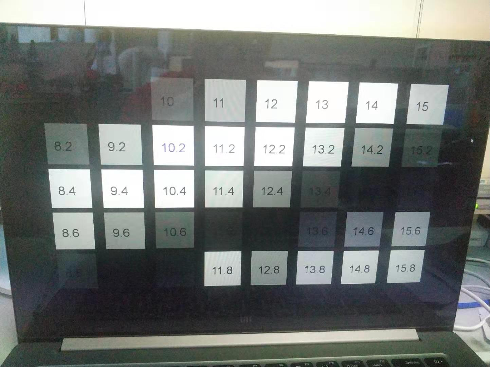
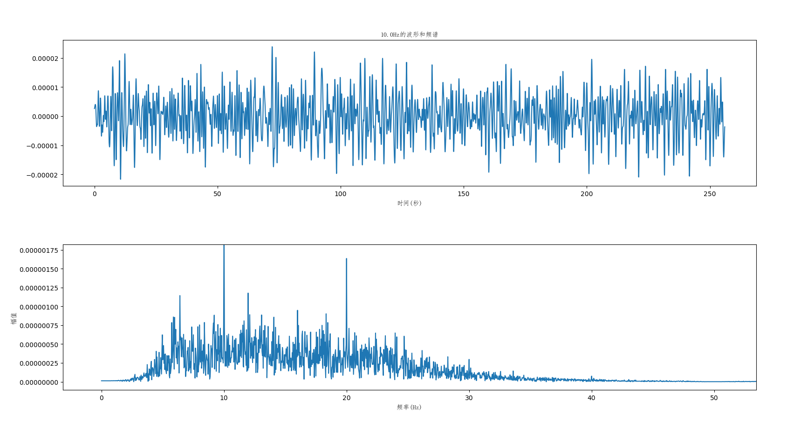
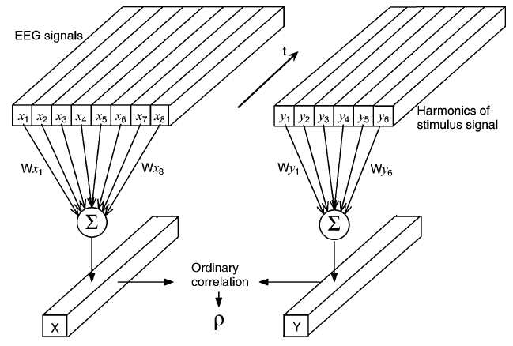
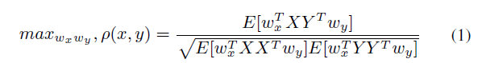
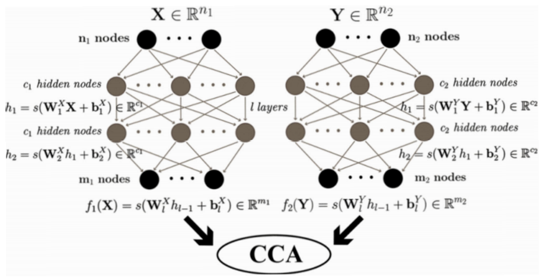
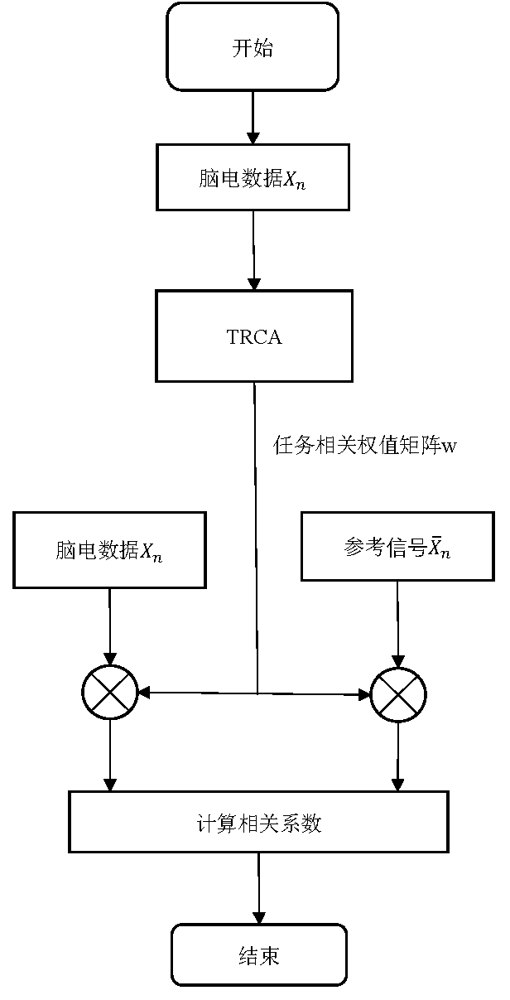

## 典型相关分析在稳态视觉诱发电位频率识别方面的应用

### 前言
&nbsp;&nbsp;&nbsp;&nbsp;随着脑机接口的快速发展，典型相关分析在稳态视觉诱发电位频率识别方面占据着重要的地位，由于脑电信号非线性的特征，使得机器学习算法在该领域的使用不具备优势，而比较信号同向变化相似率的CCA算法却取得了十分出色的效果。本文将对于CCA在SSVEP方面的应用发展以及优缺点进行介绍，希望为国内的脑机接口博客发展做出贡献。
<!--more-->
### Question 1: 什么是CCA？

&nbsp;&nbsp;&nbsp;&nbsp;CCA是一个多变量的统计方法，当有两组数据时使用，可能有一些潜在的相关性。CCA将普通的相关性扩展到两组变量。首先，CCA为两个集合找到一对称为正则变量的线性组合，使两个正则变量之间的相关性最大化。然后找到第二对，与第一对正则变量不相关，但相关性次之。构造正则变量的过程一直持续下去，直到正则变量对的数目等于较小集合中变量的数目。系数描述了两个集合之间的相关关系。但脑电信号中应用时只考虑了最大相关系数[1]。

### Question 2: 什么是SSVEP？

&nbsp;&nbsp;&nbsp;&nbsp;稳态状态视觉诱发电位(SSVEP)可定义为由快速重复的视觉刺激诱发的周期性诱发电位，其频率一般大于6hz。SSVEP由若干离散的频率分量组成。与ssvep相关的频率范围通常包括视觉刺激的基频及其谐波[1]。
&nbsp;&nbsp;&nbsp;&nbsp;SSVEP采集时以不同频率的光标闪烁刺激大脑产生相应频率的电信号，如下图所示:

&nbsp;&nbsp;&nbsp;&nbsp;SSVEP信号经过傅里叶变换后，可在刺激信号及其谐波处看到明显的尖峰，如下图所示:

#### CCA在SSVEP中的应用

&nbsp;&nbsp;&nbsp;&nbsp;CCA使用了两种信号，一个是用于刺激大脑的闪烁信号，另一个是大脑相应产生的SSVEP信号。
&nbsp;&nbsp;&nbsp;&nbsp;闪烁信号由于具有特定的频率，因此可根据傅里叶级数分解为$\sin 2{\pi}ft$, $\cos 2{\pi}ft$, $\sin 4{\pi}ft$...
&nbsp;&nbsp;&nbsp;&nbsp;如下式总结：
$$y(t) = \{ y1(t) y2(t) y3(t) y4(t) y5(t) y6(t)\} = \{ \sin 2{\pi}ft \cos 2{\pi}ft \sin 4{\pi}ft \cos 4{\pi}ft \sin 6{\pi}ft \cos 6{\pi}ft\}$$
$$t=\frac1S, \frac2S, ..., \frac{T}{S}, T是采样点数, S是采样率 $$
&nbsp;&nbsp;&nbsp;&nbsp;高阶谐波可忽略，这里取六个谐波信号。
&nbsp;&nbsp;&nbsp;&nbsp;SSVEP信号源自大脑上的不同通道，在[1]中，选择的通道为B2, Oz, O2, POz, D2, O1, PO7和PO1,共八个。
&nbsp;&nbsp;&nbsp;&nbsp;CCA的结构如下图所示：

公式如下图所示（太复杂，不想用markdown写了）

&nbsp;&nbsp;&nbsp;&nbsp;将分母设为1,该式可变为一个约束优化问题，可以用广义特征值分解的方式求解，具体的求解流程可以参考CCA的[其他博客](https://www.cnblogs.com/pinard/p/6288716.html)。
&nbsp;&nbsp;&nbsp;&nbsp;本文只做大体框架的梳理。

### Question 3: CCA的缺陷？

&nbsp;&nbsp;&nbsp;&nbsp;典型相关分析自 2006 年 Lin 等人将其应用于脑机接口以来，因其结合了空间滤波、特征提取及分类功能而深受研究者的喜爱，并且在 SSVEP 信号处理中有着极为优秀的精度。但该算法仍然存在如下问题：
&nbsp;&nbsp;&nbsp;&nbsp;1）相位漂移问题。每个受试者对于同种视觉刺激具有不同的反应时滞，从而产生了脑电数据的相位漂移问题，当相位漂移问题存在时，数据训练往往会产生较大的偏差。
&nbsp;&nbsp;&nbsp;&nbsp;2） CCA 主要用于线性信号的处理，而脑电信号为非线性信号。在 CCA 的相关实验中，假设脑电信号为刺激频率的线性输出，但实际混杂了部分环境噪声及伪迹。CCA 在 2s 以上的长时间片中的表现极为优秀，但因为其未考虑脑电信号非线性的特性，在 1s 以内短时间片处理时仍存在不足之处。
&nbsp;&nbsp;&nbsp;&nbsp;近年来，研究者针对以上问题提出了很多不同的优化方案，包括使用脑电数据替代刺激信号作为参考信号以及利用数学公式计算受试者的相位偏移等。

### CCA extend

#### DCCA(深度典型相关分析算法)

&nbsp;&nbsp;&nbsp;&nbsp;关于非线性信号处理问题，研究者们尝试加入非线性算法进行优化处理。而近年来获得研究者们青睐的深度学习算法具备着较为优秀的非线性数据处理能力，如下图所示，通过多层神经网络表达典型相关分析算法的基础结构，并在此基础加入非线性处理相关算法，构建基于皮尔逊相关系数的特征提取模型，从而达到非线性信号分析处理的效果。
&nbsp;&nbsp;&nbsp;&nbsp;深度典型相关分析算法将网络模型分为两部分，一部分为参考信号的训练网络，一部分为待检测脑电信号的训练网络，网络结构的核心部分为典型相关分析算法的多层网络实现。深度典型相关分析算法利用训练数据获取单个受试者的空间滤波权值矩阵，因该权值矩阵经过多层网络，因此获得了更好的非线性优化效果，最后单个受试者的相关脑电数据在测试时即可获得较好的优化效果[2]。
&nbsp;&nbsp;&nbsp;&nbsp;深度典型相关分析的缺陷是，其使用了深度神经网络这一需要大量训练数据的算法结构，而实际采集时脑电数据获取困难，数据量较少，另外，深度神经网络虽解决了 CCA 算法中存在的非线性信号精度丢失问题，但对于相位漂移问题缺乏较好的优化措施。
DCCA原理图：

#### TRCA(任务组成相关分析算法)

&nbsp;&nbsp;&nbsp;&nbsp;TRCA 算法从脑电数据本身出发，将脑电数据视为任务相关及任务不相关两部分，通过最大化同一类脑电数据的协方差，构建了能够提取任务相关成分的权值矩阵，即实现了一个性能优秀的空间滤波数学模型，从而在利用皮尔逊相关系数进行分类时可以获得更为出色的优化效果，其处理流程如下图所示[3]。
&nbsp;&nbsp;&nbsp;&nbsp;TRCA 算法的参考信号使用了多通道脑电数据的均值，使得待检测脑电数据与参考信号可通过同一空间滤波权值矩阵提取任务相关特征，从而增大参考信号与检测信号的相关程度。实际算法处理过程中，需基于一定数量的训练数据获得空间滤波所需的权值矩阵以进行有效的任务相关特征提取。
&nbsp;&nbsp;&nbsp;&nbsp;相对于 CCA 算法，TRCA 在短时间片数据处理中具有极大的优势。相较深度典型相关分析算法，TRCA 算法的训练数据需求相对较少，并且训练效果好，无需构建复杂的网络模型。
TRCA算法原理图:

### References

[1]《Frequency Recognition Based on Canonical Correlation Analysis for SSVEP-Based BCIs》
[2]《Deep canonical correlation analysis》
[3]《Enhancing detection of SSVEPs for a high­speed brain speller using task­related component analysis》