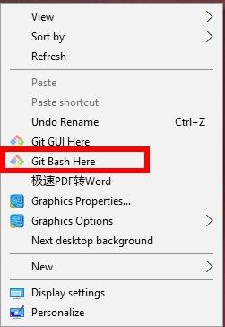
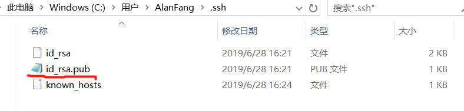
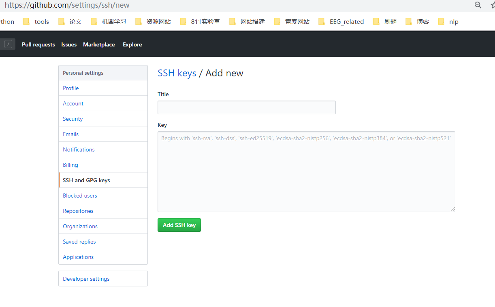
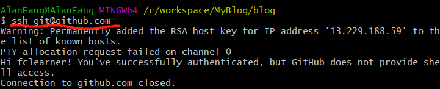
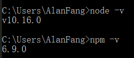
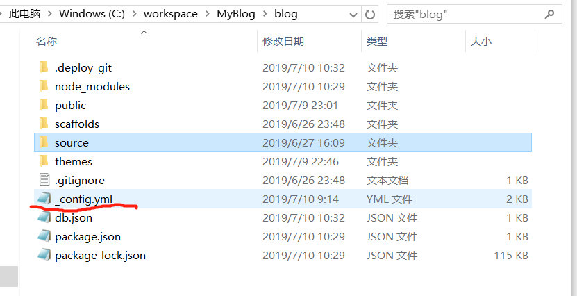
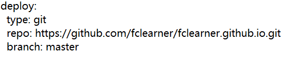
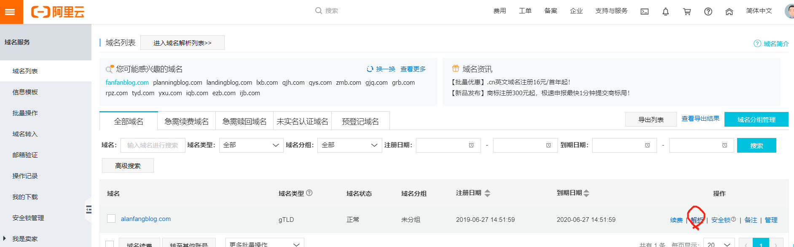
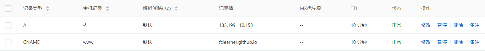
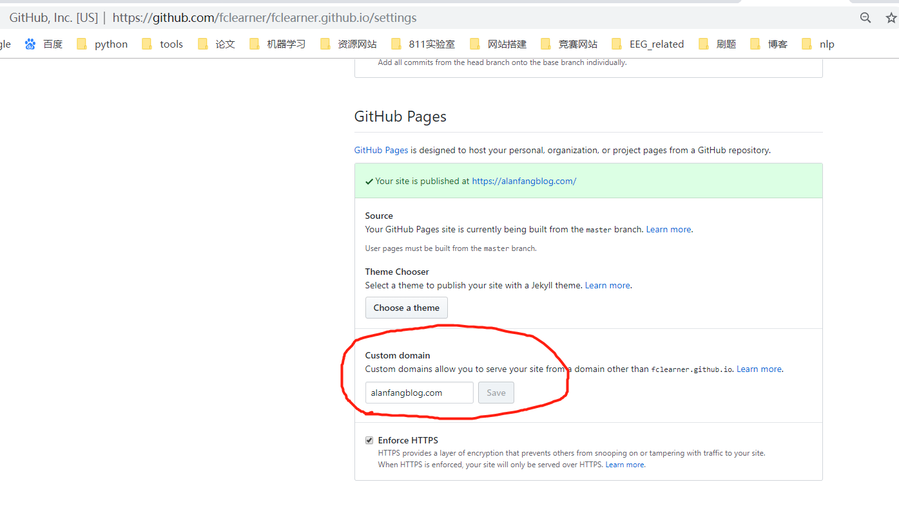

## 前言
以前一直想自己写个博客网站，无奈一直没有时间，最近在师兄和好兄弟的推荐下，使用了hexo这一基于Node.js的静态博客框架，并将其托管于github上。总算是圆了个梦！
<!--more-->
## 搭建步骤
+ github创建个人仓库
+ 安装git
+ 安装Node.js
+ 安装hexo
+ 上传博客内容至github仓库
+ 绑定域名
+ 其它
+ 附录

### github搭建个人仓库
登录github,在github仓库中创建新仓库, 仓库名按:**用户名.github.io**的格式命名, 注意:这个用户名使用你的GitHub帐号名称代替，否则在博客创建时会出现无法工作的情况。
### 安装git
git是一个分散式版本控制软件，最初由林纳斯·托瓦兹创作，于2005年以GPL释出。最初目的是为更好地管理Linux核心开发而设计。请自行搜索git下载工具。
下载安装完成后，windows右键中即可出现git bash字样。 

以下步骤是为了省去每次上传github都需要繁复输入密码:
#### 设置用户名和邮箱

```
git config --global user.name "你的GitHub用户名"
git config --global user.email "你的GitHub注册邮箱"
```
#### 生成ssh密钥文件
```
ssh-keygen -t rsa -C "你的GitHub注册邮箱"
```
#### 复制密钥
找到生成的.ssh的文件夹中的id_rsa.pub密钥, 将内容全部复制

#### 新建SSH key
打开GitHub_Settings_keys 页面, 新建new SSH Key, 将复制的内容写入key部分, title的名字可随意命名, 最后点击 Add SSH Key。

添加成功后可按下图测试。

### 安装Node.js
请自行搜索Node.js进行安装, 安装完成后, 可按下图测试。

### 安装hexo
在命令行中输入
```
npm install -g hexo-cli
```
安装时间较长, 安装完成后, 初始化博客, 输入
```
hexo init blog
```
下列为hexo常用命令:
```
hexo new myblogpage
hexo g
hexo s
hexo d
hexo clean
```
hexo new 可生成新的页面
hexo g 生成博客
hexo s 启动服务器预览
hexo d 部署至github仓库
hexo clean 清除缓存
### 上传博客内容至github仓库
首先将之前创建的github仓库与我们的博客相关联, 打开下图的_config.yml文件,该文件为hexo blog的设置文件,可在内部修改一些基础设置。

在文件的最后, 按下图编辑修改, 注意:由于语法格式问题, 冒号后请空一格, 否则无法正常工作。

设置完成后, 安装git部署插件, 输入
```
npm install hexo-deployer-git --save
```
接着, 我们分别输入三条命令
```
hexo clean 
hexo g 
hexo d
```
接着访问**XXX.github.io**, 你会发现你的博客已经上线。
### 绑定域名
上述步骤实现后, 博客已经可以正常上线, 接下来只需学会markdown的基础写作(超简单)即可正式发布博客。
但是若你不满足于XXX.github.io的网址形式, 想要个性化。那么即可购买域名与XXX.github.io进行绑定。以阿里云域名构建为例：
购买域名前,请确认你想构建的域名是否已存在。再进行购买。

域名购买成功后,按下图进入解析界面:

添加如下两个记录:

接着在github的仓库设置界面填入你的域名,保存

在本地blog/source文件夹下, 新建CNAME记事本文件, 输入域名, 建议不要加www, 保存成**所有文件**而不是**txt**文件。
接着在blog目录下执行以下三条命令即可:
```
hexo clean
hexo g
hexo d
```
域名绑定成功！
### 其它
如果你还想更换博客样式的话, 请查阅hexo更换主题相关内容, 常用的主题为next。
hexo图片加载缓慢时,可采用图床加快加载速度,具体请搜索hexo图床相关内容。

[错误 Usage: hexo < command > 解决]
这是太长时间没使用hexo的缘故，hexo更新使得原来的本地服务不能使用，需要重新部署一下hexo本地服务器
在hexo的根目录下输入命令：npm install hexo-server --save
如果没有在hexo的根目录下输入该命令，则会报错找不到package.json文件

## 附录
参考: https://zhuanlan.zhihu.com/p/26625249
